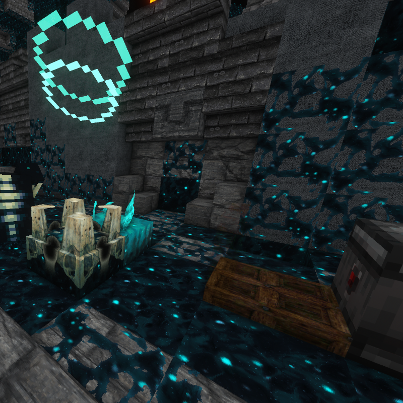

# Shriekier Shriekers

_**Patches sculk shriekers so that they react to redstone-triggered signals**_

## What Does This Mod Do?

In the early snapshots for Minecraft 1.19, sculk shriekers could be activated by redstone.
Once the version actually released, however, not only could shriekers only be triggered
by sensors, but sensors that were triggered by any "unnatural" movement (read: not belonging
to the player) would no longer trigger a shrieker.

On the whole this is probably a good thing, otherwise every time a bat spawned in the Deep Dark,
it would be like _Night of the Living Dead_ all up and down y=-51.

However, not being able to set off _synthetic_ (placed) shriekers with, say, a timer is kind of
a bummer. So this mod patches that behavior so that a shrieker's shriek can be triggered by
**non-player vibrations**, allowing players to build:
- super loud mob motion detectors
- extremely audible notifications for when a redstone process has started or completed
- or **The Mother of All Alarm Clocks**.

### Planned Features
Future updates may include the ability to configure this mod:
- to allow naturally spawning (`can_summon=true`) shriekers to be triggered as well
- to allow placed shriekers inflict the Darkness effect

## Installation, Usage and Compatibility
For multiplayer, this mod only needs to be installed **server-side**, and, assuming no other mods
are installed on the server, is confirmed working for vanilla clients.

There is currently only one build for this mod, which has been verified to be compatible with
Minecraft 1.20 and 1.20.1. It may also be compatible with future versions and snapshots (if you
find that it isn't, please
[file a bug report!](https://github.com/OpenBagTwo/ShriekierShriekers/issues/new)).

There are no current plans to backport this mod to 1.19-1.19.4, but I'll do it upon request
([open an issue](https://github.com/OpenBagTwo/ShriekierShriekers/issues/new)!)

The build has also been confirmed compatible with Quilt as well as Fabric. It does not depend on
the Fabric API. I do not currently plan to make a Forge port, but may do so
[on request](https://github.com/OpenBagTwo/ShriekierShriekers/issues/new).

## Contributing

Find a bug? Have a suggestion or a question? Want to contribute a new feature or enhancement?
[Open an issue](https://github.com/OpenBagTwo/ShriekierShriekers/issues/new)!

## License and Acknowledgements

All code in this repository is licensed under the
[GNU Affero General Public License](https://www.gnu.org/licenses/agpl-3.0.en.html).

You **may** use, modify and redistribute this mod, and  you **may** include this mod within your
modpack or run it on a server, so long as you abide by the terms of
this license, which critically states that you **must** make the source code (including your
modifications to the mod) available to anyone:
- downloading the mod (including modified versions and including within a modpack)
- playing on your server
